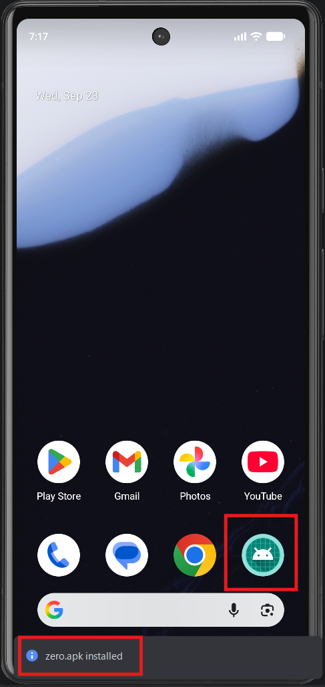
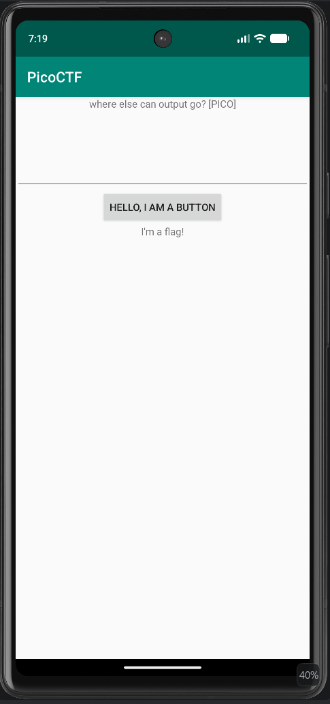
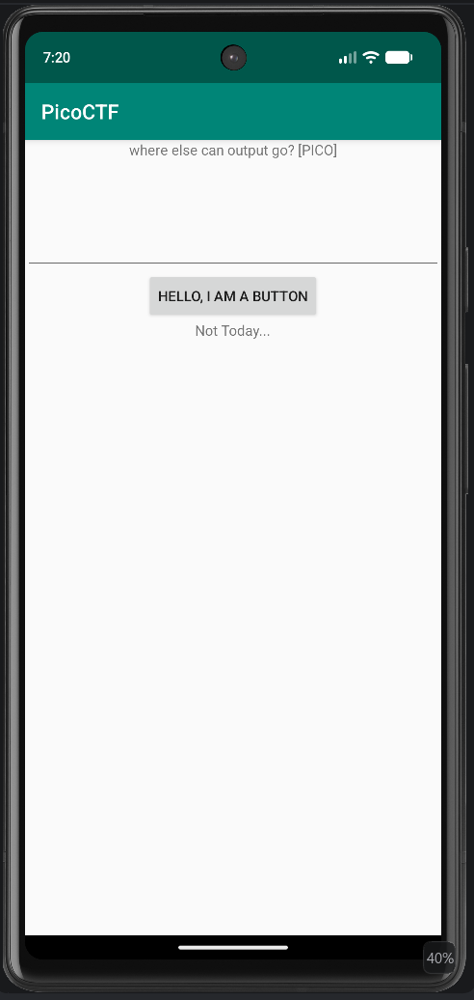

# droids0  

<br>

URL: https://learn.cylabacademy.org/library/11

<br>

```
Reverse Engineering
Hard
by Jason
picoCTF 2019

Where do droid logs go. Check out this file.
```

<br>

## フラグ取得の過程  

fileをクリックするとファイルをダウンロードすることができます。

ファイル名は「zero.apk」です。Androidのパッケージファイルです。

ヒントを参照すると、エミュレーターかデバイスを使うことと、Android Studioへのリンクが記載されています。

Android Studioをダウンロードし、インストールします。インストールが完了したらAndroid Studioを起動し、新規に空のプロジェクトを作成します。

Android StudioのIDE画面では、「Device Manager」＞「Add a new device」＞「Create Virtual Device」と選択し、適当に機種を選んで仮想デバイスを作成し、起動します。

仮想デバイスが起動し、メイン画面が表示されたら、ダウンロードした「zero.apk」ファイルを仮想画面のメイン画面上にドラッグ＆ドロップします。これで下図のように「zero.apk」が仮想デバイスにインストールされます。



インストールしたzero.apkを実行すると、「HELLO, I AM A BUTTON」のボタンを持つシンプルな画面が表示されます。



ボタンを押しても、「Not Today」と表示されるだけです。



画面上部には、「Where else can output go? [PICO]」と記載されているため、どこか別の場所に出力されていることが推測できます。


そこで、Android StudioのLogcatを起動し、ログを見てみます。

フィルターにPICOと入力してアプリのボタンを押すと、フラグがログに出力されます。

<br>
<br>
<br>
<br>
<br>
<br>
<br>
<br>
<br>
<br>
<br>
<br>
<br>
<br>
<br>
<br>
<br>
<br>
<br>
<br>
<br>
<br>
<br>
<br>
<br>
<br>
<br>
<br>
<br>
<br>
<br>
<br>

## フラグ  

> picoCTF{a.moose.once.bit.my.sister}
